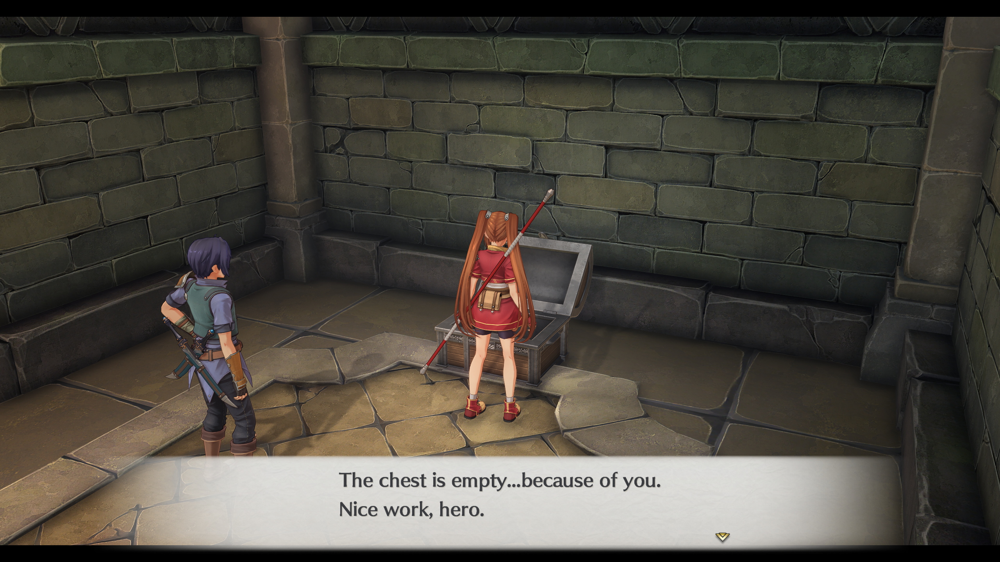

# Chest Messages for Trails Remakes

Mod(s) for _Trails_ series remakes that add the ability to interact with and read unique messages from opened treasure chests, a feature that existed in the original English PC releases.  
Supported games: **Sky 1st**

## Installation
1. Download the latest `chest-messages.zip` corresponding to your game from [Releases](https://github.com/tanabrae/TrailsRemake-ChestMessages/releases).
2. Download the latest [`xinput1_4.dll`](https://github.com/Hinkiii/sora1looseload/releases) from Hinkiii's [sora1looseload](https://github.com/Hinkiii/sora1looseload) repo. Alternatively, check out my [fork](https://github.com/tanabrae/sora1looseload) for more features.
3. Extract the `.zip` file and place the contained `scene`, `script_en`, and `table_en` folders, along with `xinput1_4.dll`, in the game root folder (where the game's `.exe` is located).

## Sky 1st Details
+ This mod was implemented using entirely engine-native systems. As a result, this mod is strictly additive; none of the base text or functionality of the game is changed or removed.
+ The messages of the original 164 chests were manually mapped to their remake equivalents, getting as close to their original placements as possible.
+ Many of the original game's chest messages have at least one exact duplicate, but most have none.
+ There are about 60 more chests in the remake than in the original. For these added chests, I decided to randomize their messages from the pool of original messages that had no duplicates, though I disqualified some specific messages reliant on location/items from being randomized.
+ No changes were made to the original messages, excluding some formatting/spacing, as they were extracted directly from the original files. I did add a single default _The chest is empty._ message to the first chest you can come across as it's new to the remake, and I wanted to retain the placements and ordering of the first couple of messages from the original.

## Compatibility
This mod may or may not be compatible with other mods that edit the games' scripts, tables, and object files. In the case that edited files are shared between mods, you will have to manually merge them for full compatibility, given both mods don't touch the exact same data.

### Show BP Mod
That said, I went ahead and merged the files of this mod and my show BP mod into a separate, standalone `.zip` for those who want to use both mods at the same time. You can read about that mod [here](https://github.com/tanabrae/TrailsRemake-ShowBP), and you can download the combined `chest-messages_show-bp.zip` in [Releases](https://github.com/tanabrae/TrailsRemake-ChestMessages/releases) for this mod. Currently supports **Sky 1st**.

## Credits
Much thanks to the many people who have developed the tools that made this project possible, primarily those from the _Kiseki Modding Discord_, as well as those who have compiled information that simplified the process!

### Community Members
+ [Kyuuhachi](https://github.com/Kyuuhachi) for developing the [Aureole-Suite](https://github.com/Aureole-Suite)
+ [eArmada](https://github.com/eArmada8) for developing [kuro_mdl_tool](https://github.com/eArmada8/kuro_mdl_tool)
+ [nnguyen259](https://github.com/nnguyen259) and the maintainers and contributors of [KuroTools](https://github.com/nnguyen259/KuroTools)
+ [Hinkiii](https://github.com/Hinkiii) for creating [sora1looseload](https://github.com/Hinkiii/sora1looseload)
+ Platinarei for initial testing and inspiration

### Misc.
+ Falcom for developing both the original games and remakes
+ GungHo for localizing the remakes
+ Xseed for their original English PC releases and chest messages
+ [TrailsInTheDatabase](https://trailsinthedatabase.com/) and the [wiki](https://kiseki.fandom.com/wiki/Main_Page) for being useful cross-references for the original games
+ Zoelius and BlazingMeat for their remake [guide](https://www.neoseeker.com/the-legend-of-heroes-trails-in-the-sky-the-1st/walkthrough)'s maps as quick references

## Disclaimers
This is a fan-made modification. All original game data belongs to their respective copyright holders, and this project is not in any way affiliated with them. Do not for any reason bother said parties as a result of this mod's existence or usage, and please do not use this mod commercially.
